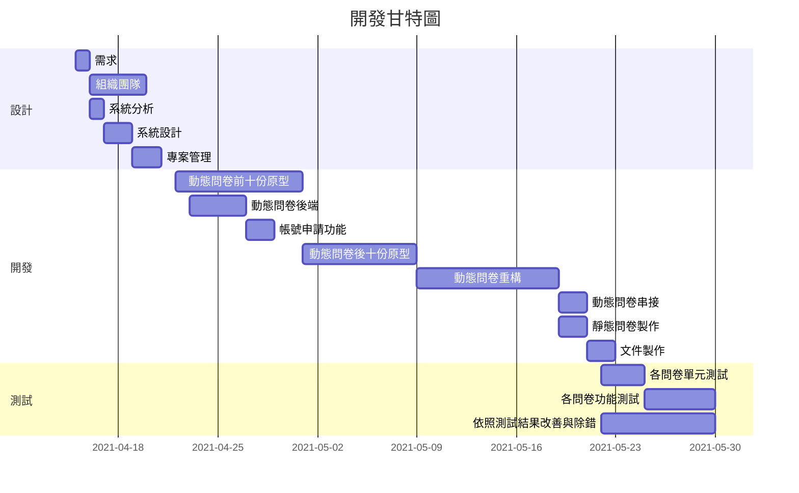

# 簡介

這是由我撰寫的 Web API 模板, 使用 TS 撰寫, 基於 express 框架。

利用 redis 做快取, 自行撰寫的測試驅動, 放在 service.test 裡,
另有搭配 swagger 做 openAPI 的驅動。

```mermaid
gantt
        dateFormat  YYYY-MM-DD

        title 開發甘特圖
        section 設計
        需求:des1, 2021-04-15, 2021-04-16
        組織團隊:after des1, 4d
        系統分析:des2, after des1, 1d
        系統設計:des3, after des2, 2d
        專案管理:after des3, 2d

        section 開發
        動態問卷前十份原型: dev1, 2021-04-22, 2021-05-01
        動態問卷後端: dev2, 2021-04-23, 2021-04-27
        帳號申請功能: after dev2, 2d
        動態問卷後十份原型: dev3, after dev1, 8d
        動態問卷重構: dev4,after dev3, 10d
        動態問卷串接: dev5,after dev4, 2d
        靜態問卷製作: after dev4, 2d
        文件製作: after dev5, 2d

        section 測試
        各問卷單元測試: 2021-05-22, 2021-05-25
        各問卷功能測試: 2021-05-25, 2021-05-30
        依照測試結果改善與除錯: 2021-05-22, 2021-05-30
```
